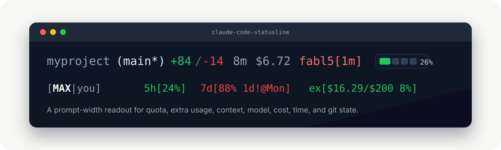

# Claude Code Statusline

> Quota, context, cost, model, and git -- live in your Claude Code prompt.

[](https://github.com/thevibeworks/claude-code-statusline/actions/workflows/test.yml)
[](https://github.com/thevibeworks/claude-code-statusline/tags)
[](LICENSE)
[](statusline.sh)
[](#install)

<p align="center">
  
</p>

<p align="center"><a href="https://thevibeworks.github.io/claude-code-statusline/"><b>Live animated demo →</b></a></p>

One Bash file that plugs into the official `statusLine` command hook. Shows
what matters: active model, context window, session cost, 5h / 7d quota with
reset times, prompt-cache health, extra-usage spend, git activity, and subscription tier.
No daemon, no telemetry, no npm.

## Install

```bash
curl -fsSL https://raw.githubusercontent.com/thevibeworks/claude-code-statusline/main/install.sh | bash
```

Downloads `statusline.sh` to `~/.claude/` and wires up `settings.json`.
Restart Claude Code (or send a message) and the statusline appears.

**Requires:** Bash, `jq`, `curl`.

### Install via Claude Code

Paste this into Claude Code and it will set everything up:

```
Install claude-code-statusline: download https://raw.githubusercontent.com/thevibeworks/claude-code-statusline/main/statusline.sh to ~/.claude/statusline.sh, make it executable, and add a statusLine command entry to ~/.claude/settings.json pointing to it with padding 0.
```

<details><summary>Manual install / inspect first</summary>

```bash
# Download and inspect
curl -fsSL https://raw.githubusercontent.com/thevibeworks/claude-code-statusline/main/install.sh -o /tmp/install-statusline.sh
less /tmp/install-statusline.sh
bash /tmp/install-statusline.sh

# Or skip the installer entirely
curl -fsSL https://raw.githubusercontent.com/thevibeworks/claude-code-statusline/main/statusline.sh -o ~/.claude/statusline.sh
chmod +x ~/.claude/statusline.sh
```

Then add to `~/.claude/settings.json`:

```json
{
  "statusLine": {
    "type": "command",
    "command": "bash ~/.claude/statusline.sh",
    "padding": 0
  }
}
```

</details>

## What It Shows

```text
project (main*)  +84/-14 1h30m $6.72 opus4.8[1m][███░░░26%] [MAX|you] 5h[87%@14:30] 7d[75%@2d] ex[$16.29/$200 8% bal$4.66]
   |       |       |      |     |       |                     |             |             |              |
 path   branch   edits   time  cost   model+context          user        5h quota      7d quota      extra usage
```

Every component earns its place:

| Signal | Why it matters |
|--------|----------------|
| Path and branch | Know where Claude Code is writing. Neutral grey; a dirty branch brightens to white with a `*`. |
| Activity | Session diff without opening git. |
| Time and cost | Track long sessions. Hours format above 60m (`1h30m`). |
| Model | Abbreviated: `claude-opus-4-8` becomes `opus4.8`, `claude-fable-5` becomes `fabl5`, `claude-sonnet-5` becomes `sonnet5`. The `[1m]` tag marks a 1M-context session, detected from the window the CLI reports (`context_window_size`) — not the name — so it shows even when Claude Code strips the `[1m]` suffix (which it does since 2.1.173 whenever 1M is the default; Sonnet 5 joined Fable 5 on that path in 2.1.197). |
| Effort | Compact lowercase badge: `lo` / `md` / `xh` / `max` / `ultra` / `auto` (`high` is the default and stays hidden). Dim for routine levels; `max` / `ultra` use the pressure color; `fast` shows in fast mode. |
| Context bar | Merged with model. Green / yellow / red by window pressure. On 1M models the bar also carries the premium input-pricing band: yellow past 200k tokens, red past 800k — the % alone looks calm (320k = 32%) while every request bills at the premium rate. A real 0% (e.g. right after `/compact` resets the window) renders a visibly empty bar `[░░░░░░0%]` — the snap to empty *is* the refresh signal; the bar hides only when no context data exists at all. Changes flash for ~60s in reverse video: `[█░░░░░30%]+9` while filling, `[░░░░░░3%]-27` right after a compaction. Cost flashes the same way, cents-precise: `$7.90+.37`. |
| User tier | Neutral white-weight (MAX bold, PRO normal, dim otherwise) — identity, never a status color. Truncated display name. |
| Quota | Integer percentages. The 5h badge always carries its reset time while a window is live — `5h[42%@14:30]` reads "42% used, resets at 14:30" — because on a 5h horizon the reset is the number you plan the current sitting around. Wall-clock, not a countdown, on purpose: Claude Code only re-renders the statusline on activity, so a relative "@1h38m" silently decays into a lie during idle gaps, while "@14:30" stays true in a frozen frame. (The 7d badge is hybrid: day-relative `@5d` while the reset is >= 24h out — decays one day per day, mild and narrow — switching to the same wall-clock `@04:00` inside the last day, where an `@6h`/`@<1h` countdown decayed by the hour exactly when pressure keeps the suffix visible.) When a window's utilization climbs between renders, a reverse-video `+N` token appears right after the badge for ~60s: `5h[44%@14:32]+2` means "you just burned 2%". A drop (window reset) stays quiet — the fresh low number is its own signal. **7d is forecast, not leveled**: a learned per-weekday burn profile (EWMA over your own usage history) plus your recent 24h burn project whether the quota outlasts the window — your heavy Tuesday counts more than a generic average. The verdict is color alone; under pressure the badge shows when relief arrives: `7d[44%@5d]` red means "at your pace, dry days before the reset 5 days from now"; inside the last day it reads `7d[92%@04:00]` — resets at 04:00. Cold start (<14 days history) falls back to window-average pacing. Recovery color when reset is imminent. **Model-scoped weekly quota**: when the usage API carries a per-model weekly limit (`limits[]`, `kind=weekly_scoped`) for the model your session is running, it renders right after the model+context block — `fabl5[1m][12%] fb[67%]` on a Fable 5 session, `op[33%]` on Opus — because the quota is a property of the model you're running, not of the account-wide 5h/7d cluster. It's a weekly number (same reset as the 7d badge), scoped to one model. Other models' scoped quotas stay hidden: only the limit constraining *this* session is signal. Supersedes the legacy `seven_day_opus`/`seven_day_sonnet` fields, which the API now sends as null. |
| Extra usage | Monthly spend, limit, prepaid balance. `--extra auto` shows when quota runs out. |
| Cache health | **Quiet until it bites.** Claude Code never re-renders an idle session, and while you work the prompt cache is always freshly ~1 TTL from expiry — so a proactive "expiring soon" isn't honestly observable, and `auto` spends no width on it. It speaks only when a rewrite actually happens: `≡!419k` the instant you resume onto a dead cache (idle longer than the TTL) or a mid-session prefix collapse — a 419k-token re-cache at ~20x the read rate (and the same burn on your 5h/7d quota on subscriptions). **Bold red past 200k** — the premium-band miss. `≡~` while a large prefix rebuilds. `--cache always` additionally keeps the freeze-safe deadline `≡@15:20` (last request + TTL; a past time in a frozen frame reads "expired at 15:20"). TTL defaults to 1h (claude.ai subscriber sessions) or 5m (API-key auth); an observed usage breakdown overrides it. The `≡` glyph (U+2261) reads as stacked cache layers — one terminal column, quiet and distinct. |

**Color follows three lanes** so a glance is unambiguous: **status**
(green/yellow/red) = pressure *only* — quota, context, cache, the premium
context band, expensive effort; **identity** (magenta/cyan/blue; fable = bright
red, matching its Claude Code TUI color) = model family; everything else is
**neutral** grey/white. Warm status color always means "near a limit or cost."

## vs Built-in `/statusline`

| Feature | `/statusline` | This repo |
|---------|:-------------:|:---------:|
| Context bar, cost, git | Yes | Yes |
| Live 5h / 7d quota | -- | Yes |
| Extra usage + prepaid balance | -- | Yes |
| Quota reset time | -- | Yes |
| Adaptive polling (30s -- 5min) | -- | Yes |
| Refresh `~` / error `!` indicator | -- | Yes |
| `--extra` display gating | -- | Yes |
| Tier display + model abbreviation | -- | Yes |
| 5 themes, 9 bar styles | -- | Yes |
| Prompt cache break detection | -- | Yes |
| OAuth + macOS Keychain | -- | Yes |
| Change flash on every refresh (`+.37` cost, `+9`/`-27` context, `+N` quota) | -- | Yes |
| Model-scoped weekly quota (`fb`/`op`/`sn`) | -- | Yes |
| Works behind trusted mitm proxies (NODE_EXTRA_CA_CERTS) | -- | Yes |
| 266 bats tests + CI | -- | Yes |

## Configuration

Flags go in the command string in `~/.claude/settings.json`:

```json
"command": "bash ~/.claude/statusline.sh --theme developer --extra on-limit"
```

| Flag | Values | Default |
|------|--------|---------|
| `--theme` | `minimal`, `compact`, `detailed`, `developer`, `manager` | (none) |
| `--style` | `unicode-blocks`, `single-block`, `bracketed-bars`, `filled-dots`, `square-blocks`, `line-segments`, `ascii-bars`, `percent-only`, `fraction-display` | `unicode-blocks` |
| `--order` | Comma-separated: `activity,time,cost,model,user,quota,extra` | all |
| `--path-display` | `project`, `cwd`, `full`, `relative` | `project` |
| `--alignment` | `left-right`, `right-left`, `center` | `left-right` |
| `--extra` | `auto`, `always`, `on-limit`, `off` | `auto` |
| `--cache` | `auto`, `always`, `off` | `auto` |
| `--debug` | Write logs to `~/.claude/statusline/logs/statusline.log` | off |
| `--test [json]` | Render with mock data | off |

### Themes

| Theme | What it does |
|-------|-------------|
| `minimal` | Model + context + user. Extra off. |
| `compact` | Everything. Unicode bars. Project path. |
| `detailed` | Bracketed bars. Working directory. |
| `developer` | Full path. Filled dots. Right-aligned. Extra on-limit. |
| `manager` | Percent-only. Cost first. Centered. |

### Extra Usage Gating

```text
--extra auto        5h[24%@14:30] 7d[10%]                               (calm, hidden)
--extra auto        5h[87%@14:30] 7d[10%] ex[$19.52/$200 10%]           (5h >= 80%, shown)
--extra always      5h[24%@14:30] 7d[10%] ex[$19.52/$200 10% bal$4.66]  (always shown)
--extra on-limit    5h[87%@14:30] 7d[10%] ex[$19.52/$200 10%]           (same as auto minus extra_util gate)
--extra off         5h[24%@14:30] 7d[10%]                               (always hidden)
```

`auto` (default) shows extra when quota runs out (5h >= 80%, 7d >= 70%) or
extra budget is pressured (utilization >= 50%). Compact by default, actionable
when it matters.

### Prompt Cache

```text
--cache auto        fabl5[1m][42%]                        (healthy: silent — no width spent)
--cache auto        fabl5[1m][5%] ≡~                      (a large prefix is rebuilding)
--cache auto        fabl5[1m][43%] ≡!419k                 (resume onto a dead cache: 419k rewrite; BOLD red >200k)
--cache always      opus4.8[1m][21%] ≡:1h@14:20           (opt in to the freeze-safe deadline; :1h = observed TTL)
--cache off         opus4.8[1m][21%]                      (disabled; no state writes)
```

**Why healthy is silent.** The server refreshes the cache TTL on every request,
so while you work the cache is always freshly ~1 TTL from expiry — there is no
honest "expiring soon" to show, and a deadline that's always ~an hour out is
pure width. The expiry only becomes *real* during an idle gap, and Claude Code
renders the statusline only on activity — so no warning can appear while you're
away. The honest moment is when you come back: the first post-idle render sees
activity resume after a gap longer than the TTL and reports the rewrite as
`≡!Nk`, sized at the re-cached prefix (`≡!419k`), **bold red past
200k** — the expensive premium-band miss. This fires even when the 300ms render
debounce skipped the `read=0` turn, because the detector keys off the stale
activity anchor, not the one-frame collapse; breaks are held ~60s so a busy
turn's refresh doesn't erase them. A cache miss re-caches the whole prefix at
~20x the cache-read rate, and on subscription plans the same multiplier lands
on your 5h/7d quota.

The activity anchor is the last observed *usage change*, not the last render —
Claude Code also re-runs the statusline on vim/permission/model changes with
unchanged usage, and re-stamping there would fake a warm cache.

**The freeze-safe deadline, on demand.** `--cache always` adds `≡@15:20`
(last request + TTL): a past time in a frozen frame reads "expired at 15:20",
so you can decide *before* typing whether to resume this session or start
fresh. Wall-clock, never a countdown — "expires in 43m" rendered an hour ago is
a lie, "@15:20" stays true however stale the frame is. Claude Code's statusline
stdin exposes aggregate cache tokens only, not the `ephemeral_1h/5m` breakdown,
so the TTL is assumed from how the CLI actually requests caching (verified in
traces): **1h for claude.ai subscriber sessions, 5m for API-key /
custom-endpoint auth** (the CLI's `FORCE_PROMPT_CACHING_5M` /
`ENABLE_PROMPT_CACHING_1H` overrides are honored). An observed breakdown wins
and renders its class as provenance (`≡:5m@14:25`). Known gap: a subscriber
session that started while on overage is latched to 5m server-side, invisible
here — the `≡!Nk` badge still reports the miss after the fact.

### Quota Polling

| 5h utilization | Interval |
|----------------|----------|
| < 20% | 5 min |
| 20 -- 49% | 2 min |
| 50 -- 79% | 1 min |
| >= 80% | 30 sec |

Error cooldown escalates with consecutive failures — 2 min, 4 min, 8 min, 10 min
cap — and a server `Retry-After` (429s carry one) extends it further. The
cooldown resets on the next successful fetch. Cache writes: atomic `mv`.

Indicators: `~` after quota = refresh in flight. A failed fetch shows why the
data may be stale: `!429` rate limited, `!auth` token rejected, `!5xx` server
error, `!net` connection failed.

### Try It Locally

```bash
echo '{"model":{"id":"claude-opus-4-8[1m]","display_name":"Opus"},"cwd":"/tmp/project","workspace":{"current_dir":"/tmp/project"},"cost":{"total_cost_usd":6.72,"total_lines_added":84,"total_lines_removed":14,"total_api_duration_ms":5400000},"version":"2.1.139"}' \
  | bash statusline.sh --test
```

## claude-watch

`claude-watch.sh` is a standalone companion that watches one session's usage in
real time -- a "top"-style full-screen view, where the statusline is a single
prompt line.

```text
━━ claude-watch ━━━━━━━━━━━━━━━━━━━━━━━━━━━━━━━━━
model  opus4.8  turns 412  2026-06-09T11:42:08Z

last turn  $0.67  in 319  out 21,274  c-read 132,952  c-make 10,960
session   $4.91  in 9,044  out 72,837  c-read 6,062,353  c-make 1,879,467

quota  5h 36%  7d 44%  extra $16.29/$200 8%  (12s ago)
forecast dry ~Mo (2.4d before reset)  profile/d Mo12 Tu16 We15 Th15 Fr9 Sa6 Su10 (ewma %)
```

It reads four things, all read-only: the session transcript (per-turn token
usage), the shared account usage cache (5h / 7d / extra quota), `usage.jsonl`,
and `forecast.cache` (the learned per-weekday burn profile statusline.sh
maintains — the forecast line projects when your quota runs dry at your own
pace and stays quiet when it outlasts the window). By default it picks the most recently modified transcript for the
current directory's project.

```bash
bash claude-watch.sh                 # auto-pick newest session in this project
bash claude-watch.sh --session ID    # watch a specific session
bash claude-watch.sh --once          # one snapshot, no watch loop
bash claude-watch.sh --interval 5    # refresh every 5s (default 3s)
bash claude-watch.sh --help
```

Cost is an **estimate** from public per-million list pricing; fast-mode
surcharges are not modeled. Quota requires `statusline.sh` to have populated
the shared usage cache. `claude-fable-5` is priced in the Opus 4.5+ capability
tier.

<details><summary>OAuth and API behavior</summary>

Quota, profile, and extra-usage requests use Claude Code's OAuth credentials
from `~/.claude/.credentials.json`. Expired tokens are refreshed automatically
via the same `refreshToken` flow the CLI uses.

If `ANTHROPIC_API_KEY`, `ANTHROPIC_AUTH_TOKEN`, or `ANTHROPIC_BASE_URL` is set,
all OAuth-dependent components (quota, user, extra) are skipped silently.

macOS Keychain is tried as fallback when no file credential exists. OrbStack
resolves the real Linux home directory via `getent passwd`.

The script never writes to Anthropic endpoints -- it only reads usage, profile,
and prepaid balance data.

**Account-scoped cache (one fetch, all sessions).** Quota / profile / prepaid
data is identical for every session on the account, so it's cached once in a
shared dir -- `~/.claude/statusline/` -- and a single fetch serves all
concurrent sessions. Per-session prompt-cache-health state stays under
`~/.claude/statusline/sessions/`. Old `$SCRIPT_DIR` state is migrated on first
run. Setting only `CLAUDE_CACHE_DIR` keeps the legacy single-dir behavior.

</details>

<details><summary>Environment variables</summary>

| Variable | Default | Purpose |
|----------|---------|---------|
| `CLAUDE_CONTEXT_LIMIT` | auto | Override context token limit |
| `CLAUDE_7D_WORKDAYS` | unset | Skip weekends in the 7d pace deadline — quota you won't spend Sat/Sun no longer counts against runway (opt-in; the limit itself stays calendar-based) |
| `CLAUDE_DATA_DIR` | `~/.claude/statusline` | Account-scoped cache + usage log location |
| `CLAUDE_CACHE_DIR` | `$CLAUDE_DATA_DIR/sessions` | Per-session cache-health state |
| `STATUSLINE_ACCOUNT` | unset | Account label for multi-account setups: renders an `@label` chip and moves account caches to `accounts/<label>/` so concurrent accounts stop sharing one quota cache |
| `DEVA_AUTH_TAG` | unset | Same as above, set automatically by [deva](https://github.com/thevibeworks/deva) from `--auth-with` (`auth-file-<stem>` -> `@<stem>`); `auth-default` means single-account and is ignored |
| `DEBUG_LOG` | `~/.claude/statusline/logs/statusline.log` | Debug log path |
| `DEBUG_LOG_MAX_BYTES` | `1048576` | Debug log size cap before rotation |
| `CLAUDE_CODE_MAX_OUTPUT_TOKENS` | `32000` | Output token reserve |
| `CLAUDE_CONFIG_DIR` | `~/.claude` | Claude config directory |

</details>

## Testing

```bash
npm exec --yes bats -- t/
```

265 tests across `t/statusline.bats` (253 statusline + integration) and
`t/install.bats` (12 installer). CI runs on push and PR to `main`.

## Project Structure

```text
statusline.sh                Main script (one file, ~2500 lines)
claude-watch.sh              Live usage/cost watcher (standalone companion)
install.sh                   One-line installer
t/statusline.bats            Unit and integration tests
t/install.bats               Installer tests (mock curl, isolated $HOME)
t/helpers.bash               Sources real functions from statusline.sh
.github/workflows/test.yml   CI workflow
CHANGELOG.md                 Release notes
CONTRIBUTING.md              Contribution guide
docs/devlog/                 Implementation history
docs/api/oauth-usage.md      Observed /api/oauth/usage contract (synced: CLI v2.1.201)
```

## Contributing

See [CONTRIBUTING.md](CONTRIBUTING.md). Short version: keep it to Bash + `jq` +
`curl`, add tests, run `bats t/` before pushing.

## License

[MIT](LICENSE)
